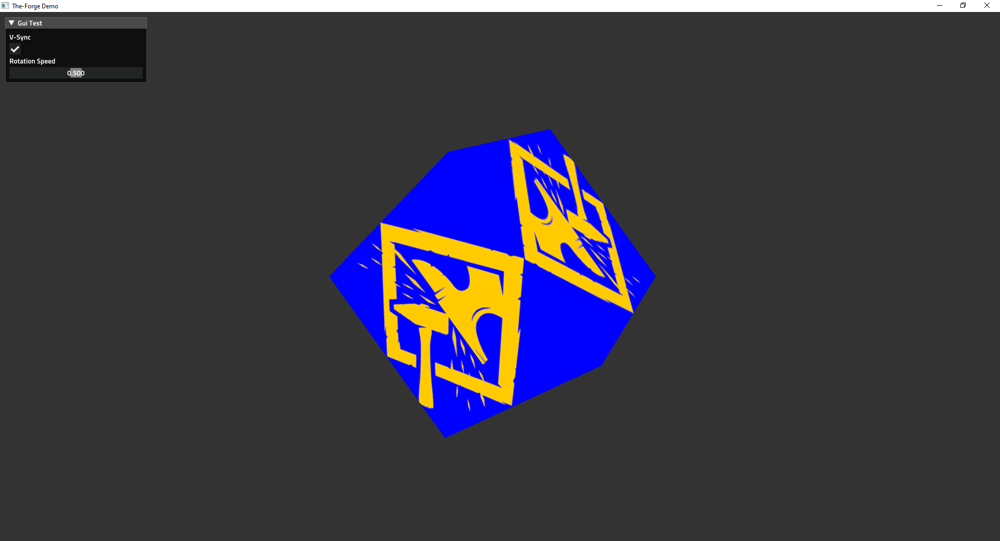

# The-Forge GLFW Demo
Unofficial simple demo showing how to use The-Forge with a 'bring your own' windowing, input, application loop, maths lib and CMake build system.

## The-Forge links
* [Homepage](https://theforge.dev/)
* [Source](https://github.com/ConfettiFX/The-Forge)

# Supported OS for this demo
* Windows 10
* Linux (Ubuntu 18.04 LTS)

# Notes
* Sorry i don't have access to other devices/OS at this stage.
* 64bit OS required.
* Linux build will likely work ok on later versions than listed. Tested with Qt Creator and GCC 7.5 on Linux Mint 19.3.
* There is an example of using the shader translator to convert source shader files to the various back ends, check the bin/shaders/src directory. Requires windows.
* LunarG Vulkan SDK 1.1.x is required when compiling with Vulkan. Version 1.2.x of the SDK is not supported at this stage. [Vulkan SDK](https://vulkan.lunarg.com/sdk/home)
* VS 2017 is the only 'official' VS version supported, it will likely work with VS 2019(untested) though.
* There is a GEN_VS.bat file you can run on windows to save running CMake yourself. It will output the build files into the 'build' directory. Genereates a VS 2017 solution.
* If you are integrating The-Forge into an existing engine, check the 'src/interfaces' directory to see what is required. These implementations you would want to point to your own engine implementations of the functionality provided there. For example: it is common for to already have a file system implementation, so you would implement the various file system calls using your engine code.

 

